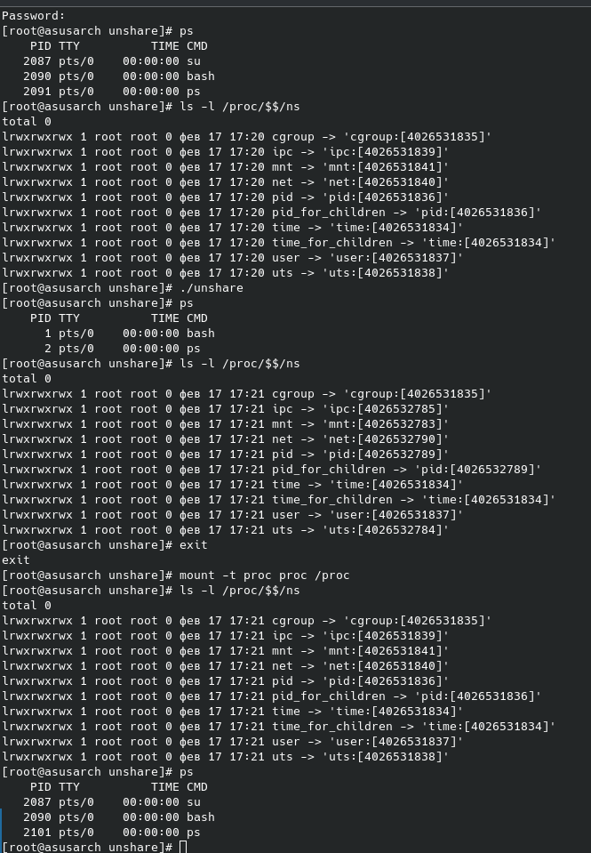

# unshare

по мотивам [https://www.youtube.com/watch?v=hdVNKmru3LM](https://www.youtube.com/watch?v=hdVNKmru3LM)

Это попытка воспроизвести тоже самое что делает docker exec

Отцепляем текущий процесс от namesapase`ов и создаем для него новые. 

делаем fork процесса и он начинает жить в новых NS

комманды:

`make build`

`ps` - смотрим процессы

`ls -l /proc/$$/ns` - смотрим namespace`ы

`./unshare` 

`ps` - тут интересно что получили pid 1

`ls -l /proc/$$/ns` - и новые namespace`ы

`exit` - убиваем pid 1

`mount -t proc proc /proc` - важно заново примонтировать `/proc`

